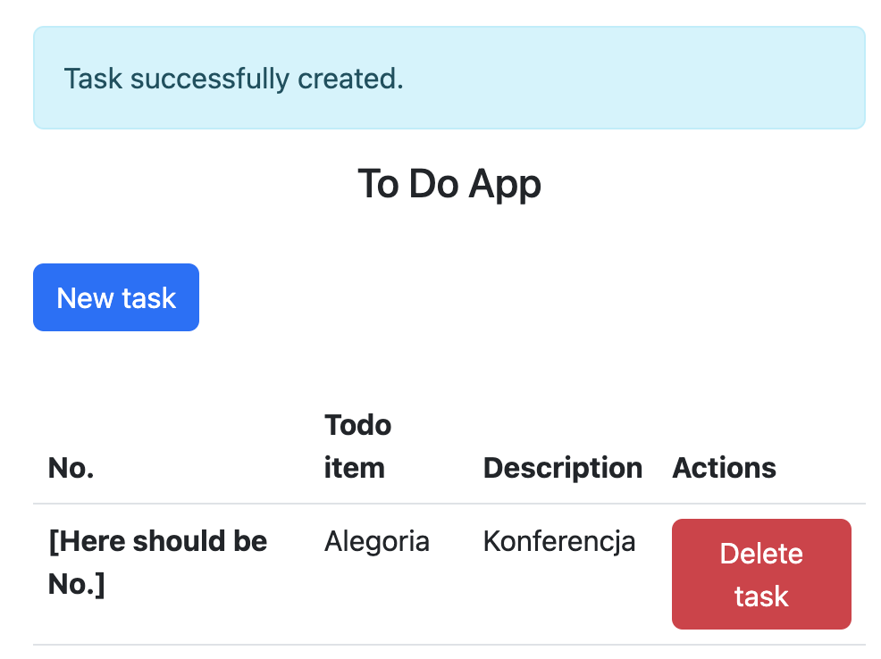

# Hiper-prosta apka TODO-list

## Co tu jest grane?
Hej!
Przed Tobą hiper-super-mega-prosta aplikacja typu **TODO list**.
Aplikacji nikomu chyba nie muszę przedstawiać:
* tworzymy zadania, które czekają na nas do zrobienia
* po czym usuwamy po ich wykonaniu!

Nic prostszego, a jednak jak pomaga w porządkowaniu rzeczy *todo*...

### Co nasza aplikacja potrafi teraz?
Główna strona to lista zadań do wykonania. 
Każde zadanie to tytuł+(ew.)opis. 
Każde zadanie można usunąć. 
Można dodać nowe zadanie - obowiązkowy tytuł i opcjonalny opis. 

### Po co Ci to wszystko mówię?
...bo chcielibyśmy poprosić Cię o podrasowanie odrobinę tej aplikacji! 
Ale po kolei. Najpierw **SETUP**

## Setup apki

### git clone + nowe repo
Przede wszystkim - **będziemy klonowali** to repozytorium i działali na Twoim. 
Dlaczego nie *fork*? 
...bo chcemy, żeby każdy działał na własną rękę ;)
Jeżeli wiesz jak to zrobić samodzielnie - możesz przejść dalej.
Jeżeli nie:
* utwórz nowe repo na swoim koncie GH
* sklonuj >>TO<< repo: `git clone https://github.com/infakt/workshops_2023_registration_rails.git`
* po przejściu do odpowiedniego folderu `cd workshops_2023_registration_rails`
* ustaw **origin na swoje repozytorium** - `git remote set-url origin git@github.com:JanKowalski/test_repo_workshops.git`
* gdzie `git@github.com:JanKowalski/test_repo_workshops.git` - to Twoje repo i Twój user :)
* zrób od razu `git push`, żeby zweryfikować czy wszystko spięło się poprawnie!

### gemy
klasyczny `bundle install`

### baza danych
W podrzuconej przez nas wersji - opieramy się o **SQLite** i gorąco zachęcamy, żeby pójść tą samą drogą. Na warsztatach równie oprzemy się o SQLite 
Dzięki temu konfiguracja bazy będzie wymagała minimum wysiłku ;)
Jeżeli zdecydujesz się na inne rozwiązanie (np. *postgres*) - pamiętaj również o odpowiedniej zmianie w `database.yml`. 
Na koniec `rails db:setup`, `rails db:migrate`, `rails db:seed` i...

### up & running
`rails s` =>  
`localhost:3000` = powinieneś zobaczyć listę tasków do zrobienia!

## Your turn!
A teraz do dzieła - Twoja kolei! 
Pamiętaj proszę, że nie oczekujemy setek linii kodu ;)  
1. Przede wszystkim... **nie działa zapis *taska*...**
* nie można zapisać nowego taska
* przez to - "nie do końca" działa test kontrolera
* spróbuj znaleźć źródło błędu i poprawić. Podpowiem, że kodu do napisania nie ma dużo :)
2. Dodanie czegoś brakującego - **"numer" (nie ID) taska**
* Na liście tasków jest kolumna `No.` w której powinien pojawić się numer kolejności taska (1, 2, 3...)
* dla wszystkich teraz - jest na sztywno `[Here should be No.]`
* dodaj obsługę dynamicznego wyświetlania tych numerów, **nie chodzi o ID tasków!**
2. Dodanie czegoś nowego - **termin realizacji zadania**
* Dodajmy możliwość określania terminu realizacji zadania
* w tym celu - nowa kolumna w tabeli *tasks*
* nowe pole w formularzu
* zmienić kolejność wyświetlania zadań na liście tak, aby te o najbliższym terminie realizacji znajdywały się najwyżej
* wyświetlić w dowolny sposób (może być brzydko, nierówno, krzywo!) *deadline* na liście zadań

## Powodzenia!

Niezależnie od tego ile i jak zrobisz - czekamy na Twoje zgłoszenie z linkiem do repo!
W razie wątpliwości - pisz śmiało na `warsztaty@infakt.pl`
